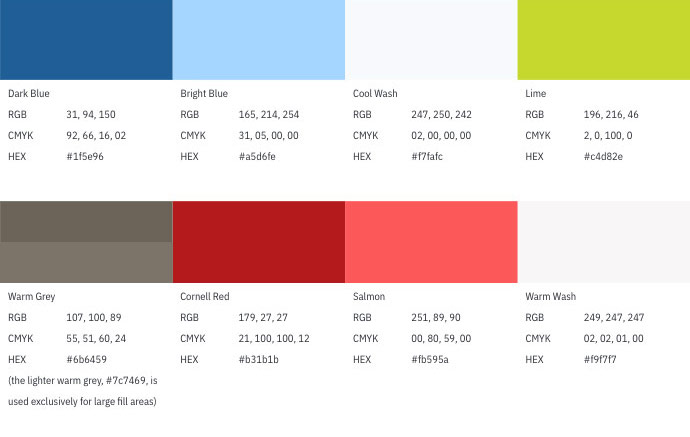
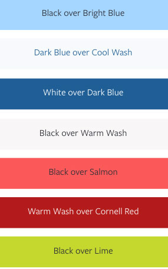
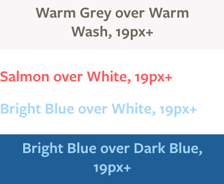

#Colors

To maintain a strong and consistent communication system for arXiv only certain specified colors may be used. Bright colors are associated with positivity, while reduced contrast (achieved with background washes) is associated with neutrality and objectivity.

{.mkd-img-left}
**Links:**  Text links use Dark Blue. This color is reserved for links and should not be used for other text. It can be used as an accent color, for example in a background or other use that does not imply it is a link.

**Headers:** Large headers are in either Black or Warm Grey. Subheaders are in Black or Salmon.

**Standard Text:** Body copy is in black, unless there is a compelling design reason for breaking that rule.

**Backgrounds:** Cool Wash and Warm Wash are both used liberally as background colors.

**Lime:** This retro color harkens back to arXiv's smileybones favicon from the 90s. It is used sparingly, and most often as a background color to the new smileybones supergraphic.

**A note about Cornell Red:** *In web interfaces red signals errors. It’s also a color that causes visibility issues for those with color blindness. Therefore red should rarely be used as a text color on the web. However Cornell Red makes a bold statement, further connects us to Cornell University’s brand, and is a powerful stylistic element when used appropriately. Please visit the ‘Web Element Patterns’ section of this guide for examples of it’s use.*

##Accessible Color Combinations
The color contrast of text is one of the pillars of an accessible website. The following color combinations are compliant with WCAG 2.1 accessibility standards.

> ###Regular font sizes
> {.mkd-img-left}
> These contrasting colors are compliant for font sizes between 10-18 px without bolding.
>   
> **Buttons:**  Standard buttons are in Bright Blue with Black type.
> 

> ###Large font sizes
> {.mkd-img-left}
> For heading, or font sizes 19px or larger, more contrasting colors options are available, in addition to the regular combinations above.
> 

