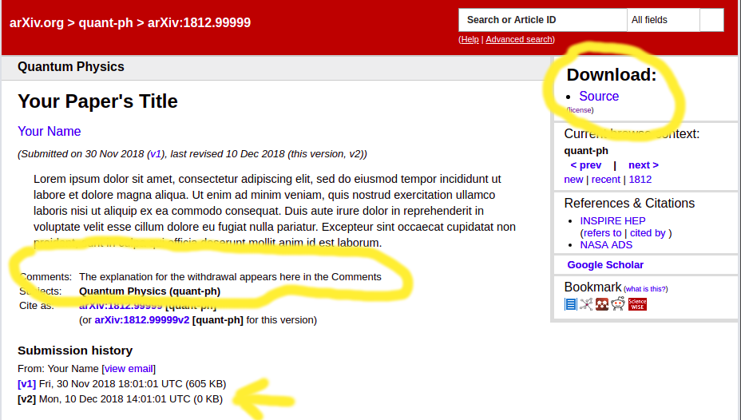
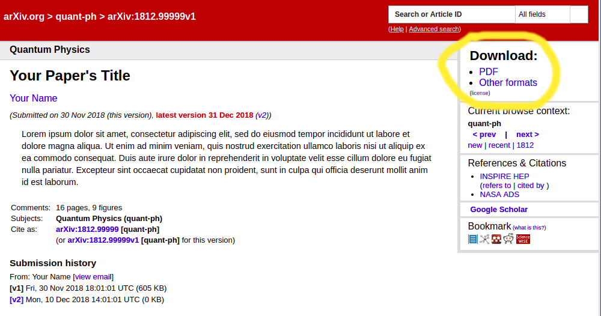

To withdraw an article
======================

Submission not yet announced
----------------------------

If your submission has not yet become [publicly
available](submit#availability) you may delete or delay it. To do either
of these things go to your [user page](http://arxiv.org/user) and select
either the Delete () or Unsubmit
() icon. Deleting a submission
will remove it from our system, unsubmitting will return it to the
[incomplete status](submit_status#incomplete) allowing modification and
later resubmission. If you have difficulty in doing either of these
things then please [contact arXiv administrators](/help/contact)
immediately. In your message be sure to include the submission
identifier, an explanation of the problem, and the reason for
withdrawal.

Article has been announced
--------------------------

Articles that have been announced and made public cannot be completely
removed. However, you may submit a withdrawal notification for your
article. To do this select the Withdraw icon () for the appropriate aritcle in the
"Articles You Own" section of your [user page](http://arxiv.org/user).

You **must** provide a specific reason for the withdrawal within the
**Comments** field. Please do not modify the abstract field unless the
comments field is inadequate for your explanation.

Note that arXiv makes all previous versions of submissions publicly
available (since October 1997). Therefore, even though the current
version of a paper may be marked as withdrawn, previous versions can
still be retrieved. See the discussion on [availability of previous
versions](versions).

Example Withdrawal
--------------------------

In this example the withdrawal has created a new version (version 2). The reason for the withdrawal is displayed in the Comments field. Under the Download options on the right there is no option to download the PDF or TeX.

Please note that when you click on the v1 option you can still access the previous version of the paper as well as access the full text (PDF or TeX).

