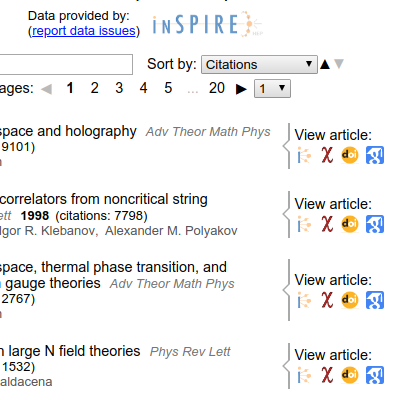
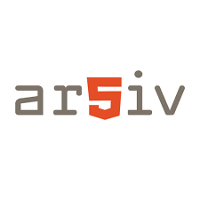
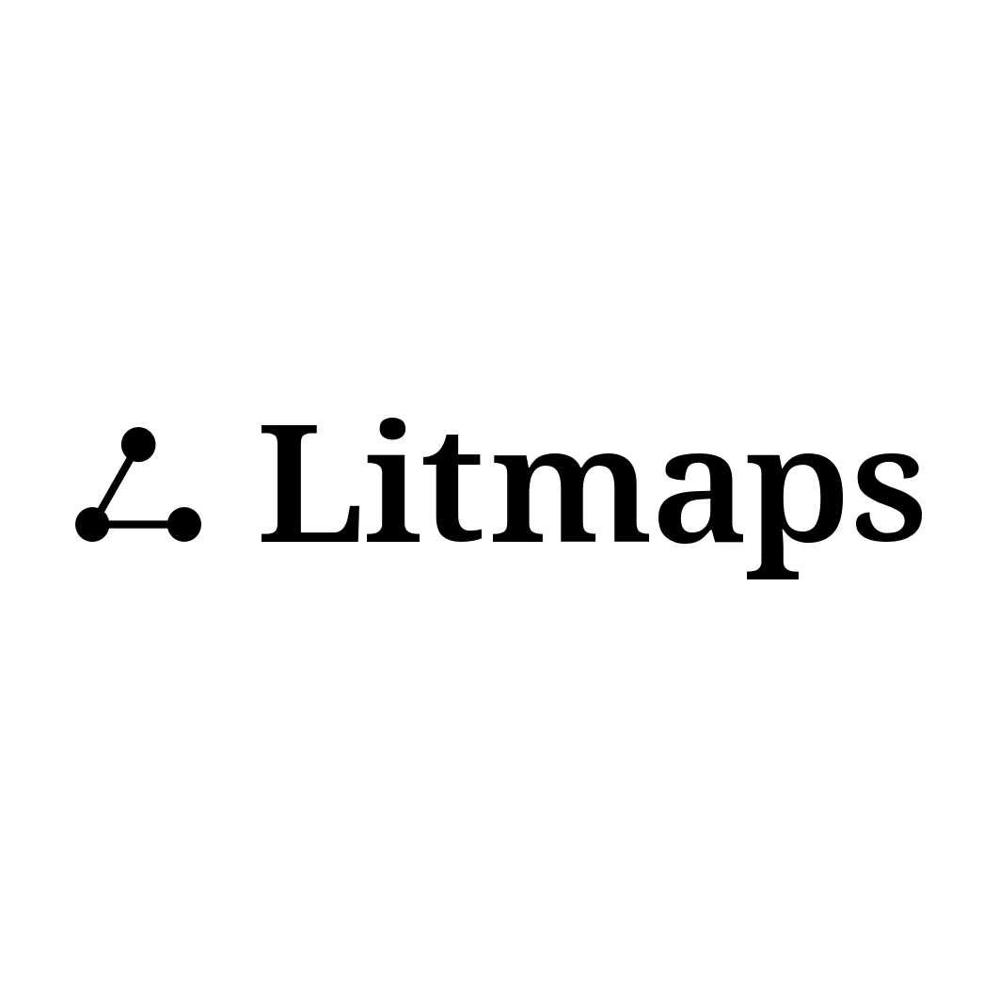
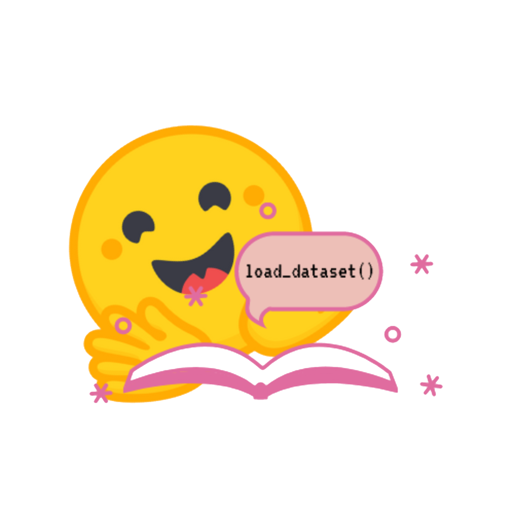
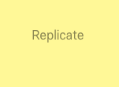

# arXivLabs: Showcase
{.mkd-img-thumb width=100 align=right alt='a bubbling beaker with a smiling face and crossedbones behind it' role=presentation}

arXiv is surrounded by a community of researchers and developers working at the cutting edge of information science and technology.

While the arXiv team is focused on our core mission—providing rapid dissemination of research findings at no cost to readers and submitters—we are excited to be experimenting with a small number of collaborators on projects that add value for our stakeholders and advance research.

Interested in proposing a new arXiv Labs project? _**Note that arXiv Labs is temporarily on pause while arXiv is focused on stability and moving to the cloud. Please check back in six months.**_

Below are some of the projects that our collaborators have done.

<!-- <a href="/project-proposal" class="button-fancy">Click to submit your idea  </a> -->

___
## arXiv Bibliographic Explorer
{.mkd-border align=left width=100 alt='a decorative icon of the Bibliographic Explorer labs project' role=presentation}

[Bibliographic Explorer code repository](https://github.com/mattbierbaum/arxiv-bib-overlay)

Collaborators: **Matt Bierbaum**, Cornell Computing and Information Science

arXiv Bibliographic Explorer displays information about works that cite and are cited by arXiv papers and their published versions. The primary objective of the project is to enable discovery of relevant research and context by providing user-friendly navigation of an article's citation tree.
___
## ar5iv
{.mkd-border align=left width=100 alt='a decorative icon of the ar5iv HTML5 Readability labs project' role=presentation}

[ar5iv code repository](https://github.com/cul-it/arxiv-readability)

Collaborators: **Michael Kohlhase and Deyan Ginev** from Friedrich-Alexander Universität Erlangen-Nürnberg, and **Ben Firschman** from arXiv-Vanity.

Our top priority is to provide a high-quality service to all arXiv authors and readers. The overarching objective of this project is to significantly improve the usability and accessibility of arXiv papers. While providing HTML is not a panacea, it is a first step in the right direction.
___
##CORE recommender
{.mkd-border align=left width=100 alt='a decorative icon of the Core Recommender labs project' role=presentation}

[CORE Recommender arXiv paper](https://arxiv.org/abs/1705.00578), [Research outputs by CORE](https://core.ac.uk/about/research-outputs/)

Collaborators: **[CORE Team](https://core.ac.uk/about/#team)**

Explore relevant open access papers from across a global network of research repositories while browsing arXiv. Research papers are recommended from both arXiv and other over 10 thousand open access data providers and brought to you by <a href="https://core.ac.uk/" target="_blank" rel="noopener">CORE</a>, the world’s largest aggregator of open access research.
___
## arXiv Links to Code & Data
{.mkd-border align=left width=100 alt='a decorative icon of the Links to Code & Data labs project' role=presentation}

[Links to Code repository](https://github.com/arXiv/arxiv-browse/tree/develop/browse/static/js/paperswithcode.js)

Collaborators: **Robert Stojnic, Viktor Kerkez, and Ludovic Viaud**, from Papers with Code / Meta AI Research

arXiv Links to Code & Data aims to provide an easy and convenient way to find relevant code for a paper. It is using data from <a href="https://paperswithcode.com" target="_blank" rel="noopener"> Papers with Code</a> - a free resource that links papers, code and results in Machine Learning. Papers with Code is the biggest such resource and is licensed under an open license.
___
## Connected Papers
{.mkd-border align=left width=100 alt='a decorative icon of the Links to Code labs project' role=presentation}

[Connected Papers code repository](https://github.com/arXiv/arxiv-browse/tree/develop/browse/static/js/connectedpapers.js), [about Connected Papers](https://www.connectedpapers.com/about)

Collaborators:
**Alex Eitan Tarnavsky, Eddie Smolyansky, Itay Knaan Harpaz, and Sahar Perets**, from Connected Papers

<a href="https://www.connectedpapers.com" target="_blank" rel="noopener">Connected Papers</a> is a unique, visual tool to help researchers and applied scientists find and explore papers relevant to their field of work. You can use Connected Papers to:

* Get a visual overview of a new academic field
* Create a bibliography to your thesis
* Discover the most relevant prior and derivative works
* Or simply explore paper-space!
___
##Litmaps
{.mkd-border align=left width=100 alt='a decorative icon of the Litmaps labs project' role=presentation}

[About Litmaps](https://www.litmaps.co/about)

Collaborators:
**Kyle Webster, Axton Pitt, Digl Dixon, Hamish Huggard, Racheal Reeves**, Litmaps

<a href="https://www.litmaps.co" target="_blank" rel="noopener">Litmaps</a> is an innovative research discovery tool. It combines interactive citation maps, modern search tools, and targeted updates to create a cohesive research discovery experience. It can visualize your research topic with everything from articles, patents, books, pre-prints, and e-prints. From arXiv abstract pages, you can build a literature map from the arXiv article you are viewing, visualizing the top connected articles, and browse the citation network around it.
___
##Hugging Face Spaces

{.mkd-border align=left width=100 alt='a decorative icon of the Hugging Face labs project' role=presentation}

[About Hugging Face](https://huggingface.co/huggingface)

Collaborators: **Abubakar Abid**, **Omar Sanseviero**, **Ahsen Khaliq**, and the **[Hugging Face team](https://huggingface.co/huggingface)**

 Hugging Face Spaces includes links to demos created by the community or the authors themselves. By going to the Demos tab of your favorite paper in the arXiv categories of computer science, statistics, or electrical engineering and systems science, you can find links to open-source demos and try them out immediately. With Spaces, Hugging Face users can share, explore, discuss models, and build interactive applications that enable anyone with a browser to try them out without having to run any code. These demos are built using open-source tools such as the Gradio and Streamlit Python libraries, and leverage models and datasets available on the Hugging Face Hub.
___
##IArxiv
{.mkd-border align=left width=100 alt='a decorative icon of the IArxiv labs project' role=presentation}

[About IArxiv](https://iarxiv.org/about), [Sign up for IArxiv](https://iarxiv.org/home)

Collaborators: **Ezequiel Alvarez**, ICAS, Professor at UNSAM, **Cesar Miquel**, Easytech, and the **[Easytech team](https://iarxiv.org/about)**

IArxiv allows readers to receive, by email, daily arXiv papers in a growing number of categories sorted by artificial intelligence according to their preferences. IArxiv learns each reader’s preferences first by fetching previous papers authored by the reader. Then, those preferences are updated over time based on the papers opened by that reader within the emails or on iarxiv.org. IArxiv runs an unsupervised Machine Learning algorithm, called LDA, to extract which topics are present in each paper, and in which proportions, to construct a vector of topics for each reader.
___
##Scite Smart
{.mkd-border align=left width=100 alt='a decorative icon of the Scite Smart labs project' role=presentation}

[About Scite Smart](https://scite.ai/)

Collaborators: **Josh Nicholson**, **Domenic Rosati**.

Scite is a platform for discovering and evaluating scientific articles via Smart Citations. Smart Citations allow users to see how a publication has been cited by providing the context of the citation and a classification describing whether it provides supporting or contrasting evidence for the cited claim. With the Scite Smart Labs project, viewers can see this information directly on the abstracts page.
___
##ScienceCast
{.mkd-border align=left width=100 alt='a decorative icon of the ScienceCast labs project' role=presentation}

[About ScienceCast](https://sciencecast.org/pages/about)

Collaborators: **JVacheh Joakim**, Science Cast, Inc.

ScienceCast links arXiv papers to interactive video presentations. ScienceCast is a free open-access platform for researchers to disseminate their scientific results and ideas to a wide audience of fellow scientists.
___
##Replicate
{.mkd-border align=left width=100 alt='a decorative icon of the Replicate labs project' role=presentation}

[About Replicate](https://replicate.com/about), [Replicate arXiv docs](https://replicate.com/docs/arxiv)

Collaborators: **The Replicate Team**

Machine learning is still extremely hard to use. Research is typically published as a PDF, with scraps of code on GitHub and weights on Google Drive. The Replicate Labs project makes it easy to share and associate your machine learning model with your arXiv paper in a way that is easy for other people to use.
___

We are grateful to the [volunteer developers](https://arxiv.org/about/people/developers) who contribute to the arXiv codebase and invite you to get involved. Please see the [arXivLabs invitation to collaborate](https://arxiv.org) and [guidelines for contributors](https://github.com/arXiv/.github/blob/master/CONTRIBUTING.md), or contact nextgen@arxiv.org, for more information about contributing to arXivLabs.
